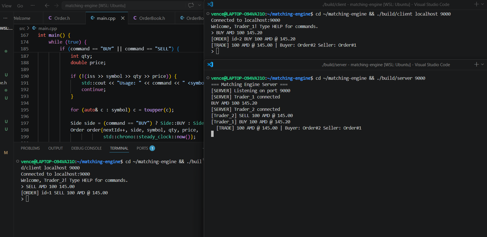

# Matching Engine

A high-performance order matching engine written in C++17. Simulates the core of a stock exchange — receiving buy/sell orders, matching them by price-time priority, and generating trades.

Supports standalone interactive mode, multi-threaded simulation, and networked multi-client trading over TCP.



## Performance

### Pure add workload
Nothing but new orders — measures raw matching path.

| Orders | Trades | Avg Latency | Throughput |
|--------|--------|-------------|------------|
| 1,000 | 774 | 0.58 μs | 476K orders/sec |
| 100,000 | 77,969 | 0.43 μs | 1.44M orders/sec |
| 1,000,000 | 777,781 | 0.42 μs | 1.46M orders/sec |

### Mixed workload (75% add + 25% cancel)
Realistic HFT-style traffic. Cancels dominate tail latency because they must locate an arbitrary order inside the book.

| Version | Ops | Throughput | p50 | p99 | p99.9 |
|---------|-----|------------|-----|-----|-------|
| O(n) cancel (before) | 100K | 69K ops/sec | 574 ns | **110 μs** | **192 μs** |
| O(1) cancel (after) | 100K | 1.12M ops/sec | 554 ns | **1.8 μs** | **8.3 μs** |
| O(1) cancel (after) | 1M | 918K ops/sec | 595 ns | 2.3 μs | 12 μs |

**Result: 16× throughput, 62× p99, 23× p99.9 reduction on the same workload.** The 1M-operation test did not complete in several minutes on the old version; the new version finishes in ~1 second.

## Features

- **Price-time priority matching** — highest bid and lowest ask matched first; ties broken by arrival time (FIFO)
- **Limit and market orders** — full-fill, partial-fill, and market orders that walk the book
- **O(1) order cancellation** — `unordered_map<id, iterator>` index avoids scanning the book
- **Multi-symbol support** — independent order books per symbol (AMD, NVDA, TSM, etc.)
- **Trading session stats** — open/high/low/close, VWAP, volume, trade count per symbol
- **Latency histogram** — per-operation p50 / p90 / p99 / p99.9 / max reporting
- **Random order simulator** — up to 10M operations with configurable add/cancel mix
- **Multi-threaded simulation** — separate ingestion and matching threads connected by a thread-safe queue
- **TCP server/client** — multiple traders connect over the network and trade against each other in real time
- **Interactive CLI** — place orders, view the book, and run simulations

## Build

Requires CMake 3.14+ and a C++17 compiler.

```bash
cmake -B build
cmake --build build
```

This produces three executables: `engine` (standalone), `server`, and `client`.

## Usage

### Standalone Mode

```bash
./build/engine
```

```
> BUY AMD 100 145.20
[ORDER] id=1 BUY 100 AMD @ 145.20

> SELL AMD 60 145.00
[TRADE] 60 AMD @ 145.20 | Buyer: Order#1 Seller: Order#2

> BOOK
=== Order Book ===
  --------------------
  BID 145.20 x 40

> SIM AMD 1000000
=== Single-Thread Simulation ===
  Symbol:          AMD
  Operations:      1000000
  Adds:            750132
  Cancels:         249868 (hits: 54510)
  Trades:          583137
  Total time:      1089.04 ms
  Avg latency:     0.75 us/op
  Throughput:      918244 ops/sec

=== Single-Thread Mixed (add+cancel) Latency (n=1000000) ===
  p50:   595 ns
  p90:   1283 ns
  p99:   2337 ns
  p99.9: 12098 ns
  max:   12389886 ns
```

### Networked Mode

Start the server:

```bash
./build/server 9000
```

Connect clients from separate terminals:

```bash
./build/client localhost 9000
```

Multiple clients can trade against each other in real time. Each client gets an independent session, and orders are matched across all connected traders.

## Test

11 unit tests covering matching logic, price/time priority, partial fills, cancellation, and trade pricing.

```bash
cd build && ctest --output-on-failure
```

Optional: run tests with ThreadSanitizer (useful for concurrency checks):

```bash
cmake -S . -B build-tsan -DENABLE_TSAN=ON
cmake --build build-tsan
cd build-tsan && ctest --output-on-failure
```

## Project Structure

```
matching-engine/
├── CMakeLists.txt
├── include/
│   ├── Order.h              # Order and Side definitions
│   ├── OrderBook.h          # OrderBook class and Trade struct
│   ├── ThreadSafeQueue.h    # Lock-based concurrent queue
│   ├── SessionStats.h       # Trading session tracking
│   ├── LatencyStats.h       # Latency histogram (p50/p90/p99/p99.9/max)
│   └── Server.h             # TCP server class
├── src/
│   ├── OrderBook.cpp         # Matching and O(1) cancel logic
│   ├── main.cpp              # Standalone CLI and simulators
│   ├── Server.cpp            # TCP server implementation
│   ├── server_main.cpp       # Server entry point
│   └── client.cpp            # TCP client
├── tests/
│   └── test_orderbook.cpp    # Google Test unit tests
├── docs/
│   ├── demo.png              # Demo screenshot
│   └── optimization.md       # O(n) → O(1) cancel writeup
└── .github/workflows/
    └── ci.yml                # GitHub Actions CI
```

## Technical Details

- **Order book**: `std::map<double, std::list<Order>>` — price levels sorted by comparator, FIFO within each level
- **Bid side**: `std::greater<double>` comparator so highest bid is always at `begin()`
- **Ask side**: default `std::less<double>` so lowest ask is always at `begin()`
- **Order index**: `std::unordered_map<int, {side, price, list::iterator}>` for O(1) cancel. `std::list` chosen over `std::deque` because middle-erase does not invalidate other iterators, which is essential for the index to stay valid across cancels and partial fills.
- **Index maintenance**: every path that removes an order from the book (cancel, full fill during match) also erases the index entry — otherwise later cancels would dereference stale iterators.
- **Matching**: aggressive order walks the opposite side of the book until fully filled or no more matching prices
- **Concurrency**: `ThreadSafeQueue` uses `std::mutex` + `std::condition_variable` for producer-consumer synchronization
- **Networking**: POSIX TCP sockets, one thread per client, `std::mutex` protects shared order book state
- **Benchmarking**: `std::chrono::steady_clock` nanosecond timing; `LatencyStats` collects samples and reports percentiles by sorted-vector method (exact, not bucketed)

## Roadmap

- [x] Core matching engine with price-time priority
- [x] Multi-symbol support
- [x] Random order simulator with benchmarking
- [x] Multithreading with thread-safe queue
- [x] TCP server and client
- [x] Market orders
- [x] Trading session stats (OHLC, VWAP)
- [x] Latency histogram (p50/p90/p99/p99.9)
- [x] O(1) cancel via order-id index
- [ ] Memory pool for order nodes (eliminate `std::list` allocation slow paths in tail latency)
- [ ] Trade log CSV export
- [ ] Historical replay from CSV